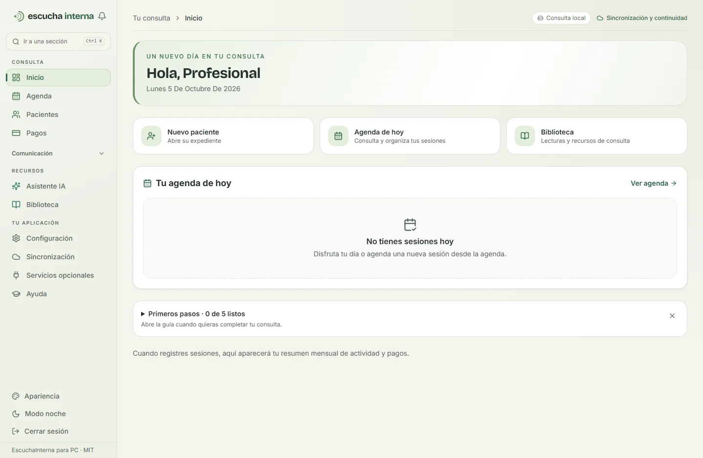

# EscuchaInterna para PC

Programa de escritorio en español para gestionar una consulta psicológica: agenda, pacientes, expedientes, notas de sesión, pagos y archivos. Funciona en la propia PC y reutiliza la aplicación web de EscuchaInterna.

**Windows de 64 bits · Código abierto MIT · Temas y sincronización cifrada con Drive**

[Descargar para Windows](https://github.com/er3system/escuchainterna-desktop/releases) · [Ver el proyecto](https://escuchainterna.com) · [Apoyar a Laroc en Ko-fi](https://ko-fi.com/laroc)

[Manual de usuario PDF](public/manual-escuchainterna.pdf) · [Guía para agentes de IA y colaboradores](docs/guia-para-ias.md)



## Apoya el proyecto

EscuchaInterna para PC es gratuito y su código se publica con licencia MIT. Si te resulta útil, puedes [invitar a Laroc a un café en Ko-fi](https://ko-fi.com/laroc) y ayudar a sostener su desarrollo. El apoyo es voluntario: no desbloquea funciones ni sustituye una suscripción. También puedes reportar errores, proponer mejoras, revisar documentación o contribuir código en GitHub.

## Instalar

Descarga el instalador `.exe` desde [Releases](https://github.com/er3system/escuchainterna-desktop/releases). El programa incluye los componentes necesarios; no necesitas instalar Node.js ni configurar una base de datos.

La primera vez crea tu cuenta local. Esta edición no tiene período de prueba ni suscripción. La cuenta y los expedientes pertenecen a esta instalación; no son una cuenta de la web. Usa el menú del programa para crear un respaldo y restaurarlo en otra instalación.

Desde 0.4.0 el registro permite elegir **Solo en esta PC** o **Preparar Google Drive**. Si ya tienes una consulta en Drive, recíbela antes de crear otra cuenta. El asistente detecta Mi unidad en Windows; el inicio de sesión de Google se realiza en Drive para escritorio.

## Servicios opcionales con claves propias

En **Servicios opcionales** —también dentro de Configuración—, conecta **Resend** para enviar correo, **OpenAI** para el chat o **Anthropic** para el chat y las herramientas clínicas. Introduce tu clave API, remitente o modelo y autoriza el tratamiento necesario. Las claves se cifran por cuenta, no vuelven al navegador y están incluidas en los respaldos y versiones cifradas de Drive. La configuración no afirma haber validado saldo o acceso: se comprueban al usar el servicio.

Desde 0.7.0, **Google Calendar** tiene una pantalla propia accesible desde Agenda y Servicios opcionales. Importa tu cliente OAuth de escritorio y autoriza en Google. Puedes publicar horarios privados sin datos de pacientes y comprobar coincidencias con tu calendario principal. La publicación es manual; no importa cambios desde Google ni ejecuta tareas con la app cerrada. Consulta [la configuración y el contrato de Calendar](docs/desktop-google-calendar.md).

Los proveedores requieren internet y facturan directamente a tu cuenta. Sin clave, la consulta conserva el modo local; los correos sin proveedor quedan como registros sin enviar. Resend requiere un remitente de un dominio verificado. OpenAI usa Responses con `store: false`; su integración cubre el chat, mientras las herramientas de notas e informes siguen locales salvo que conectes Anthropic. Una suscripción de ChatGPT no incluye el uso de su API.

Los correos pendientes se reintentan desde **Mensajes**, acotados al dueño autenticado. Las automatizaciones se revisan al abrir Marketing, no con el programa cerrado. WhatsApp Business, Meet y pagos automáticos muestran requisitos y guías; sus adaptadores no están implementados en PC y no se simulan conexiones. Los enlaces de esta PC no son una web pública.

El respaldo inicial admite hasta 256 MiB de datos antes de comprimir. Conserva su contraseña: será necesaria para restaurar. Para imprimir o guardar una vista como PDF, usa el menú del programa y el diálogo de Windows.

## Consentimientos recibidos

Desde 0.8.0, **Consulta → Consentimientos** recibe PDF e imágenes desde una carpeta privada de Drive para escritorio. La revisión se ejecuta cada treinta segundos mientras el programa está abierto y tienes una sesión activa. El documento aparece en una bandeja: abre el original, confirma el paciente y la fecha de firma antes de archivarlo. Los códigos generados en el expediente sugieren el paciente; la llegada del archivo no confirma una firma ni autoriza IA.

Puedes colocar archivos directamente en la carpeta o configurar el formulario y script incluidos para recibirlos con Google Forms. La copia local queda cifrada, conserva el original y entra en los respaldos de la consulta. La carpeta de recepción se configura por PC y debe ser distinta de la sincronización cifrada. Consulta [la guía de recepción y configuración de Google](docs/desktop-consent-reception.md).

## Apariencia y continuidad entre PCs

Elige modo **Día**, **Noche** o **Automático**, con las paletas Bosque, Salvia, Jardín, Océano, Lavanda y Terracota. Se combinan colores de acción y acentos con superficies neutras. La bienvenida y **Configuración → Apariencia** guardan tu elección en este equipo. Las transiciones respetan el movimiento reducido de Windows y se pueden desactivar.

Desde 0.5.0 el menú agrupa las secciones por tarea. **Ctrl+K** abre el buscador de secciones; la banda superior muestra tu ubicación y permite volver a la sección principal. Sincronización y servicios opcionales tienen acceso directo.

En 0.6.0, al abrir el programa con una sesión válida accedes directamente a tu espacio según tu rol; si falta la configuración inicial, se conserva el onboarding. Inicio pone **Nuevo paciente**, **Agenda de hoy** y **Biblioteca** a mano, y deja los primeros pasos en una guía desplegable debajo de la agenda. Comunicación se despliega al usarla. Ctrl+K también encuentra acciones y funciona con el menú móvil cerrado. La IA conserva su sección y deja libre el contenido al retirar el botón flotante en PC.

**Ayuda → Guía de uso en PC**, también con **F1**, explica respaldos, Drive, catálogos, servicios y atajos. Los tutoriales describen citas locales y distinguen registros pendientes de envíos reales. El lector de libros conserva los filtros y la página al volver al catálogo; una página fuera del rango vuelve a la última válida. Consulta [las decisiones de producto](docs/desktop-product-review.md).

## Catálogos locales

La biblioteca tiene dos vistas: **Colección EscuchaInterna**, con lector de publicaciones, y **Libros de esta PC**, con categorías, búsqueda y paginación. Los catálogos privados se instalan fuera de la consulta clínica, en `catalogos` junto a la carpeta `workspace` de la instalación. Se instalan aparte en cada PC; no viajan en el respaldo clínico de Drive.

Para instalar catálogos que ya tienes, cierra el programa y ejecuta `node scripts/install-local-catalogs.mjs --books "RUTA_ABSOLUTA_LIBROS" --publications-root "RUTA_ABSOLUTA_PROYECTO_ORIGINAL" --destination "RUTA_ABSOLUTA_DATOS_USUARIO/catalogos"`. Puedes omitir uno de los dos orígenes. El script copia archivos admitidos, valida las rutas, conserva los originales y rechaza sobrescribir contenidos distintos. El origen de publicaciones debe contener su manifest y los archivos referenciados; también puede contener el catálogo CIE-11. Reinicia y pulsa **Actualizar índice** o **Recargar catálogo** si ya había contenidos indexados.

En **Configuración → Sincronización con Drive**, conecta una carpeta de Google Drive para escritorio que esté disponible sin conexión. Usa la misma contraseña en ambas PCs. Publica los cambios al terminar, espera a que Drive los entregue y recibe la versión antes de continuar en la otra PC. Una instalación vacía puede recibir desde **Continuar desde otra PC** o el menú Archivo.

Se transfieren versiones cifradas del espacio completo, incluidas todas las cuentas, adjuntos y claves; la base activa permanece en el disco local. Las versiones divergentes se conservan y requieren elegir cuál continuar. La app no combina expedientes automáticamente ni confirma la entrega a la nube. Consulta [la guía de sincronización y recuperación](docs/desktop-sync.md).

Los datos se guardan en la carpeta de usuario de Windows, fuera del programa. Las actualizaciones conservan ese espacio de trabajo. El instalador inicial no tiene firma Authenticode; en la release se publica su SHA-256.

## Qué funciona en local

Agenda, registro e importación de pacientes, expedientes clínicos, notas, archivos y registro de pagos usan SQLite y archivos en la PC. La autenticación, los permisos por profesional y el cifrado de campos se conservan. El modo escritorio no crea usuarios ni pacientes demo.

Las integraciones externas necesitan conectividad y un proveedor configurado. El outbox local registra mensajes, pero no significa que se hayan entregado por correo o WhatsApp. Los enlaces con dirección local solo funcionan en esta PC. Los recordatorios no se ejecutan si el programa está cerrado.

El catálogo CIE-11 y las publicaciones de la instalación original se distribuyen por separado y no vienen incluidos en esta primera versión pública. Consulta [THIRD_PARTY_NOTICES.md](THIRD_PARTY_NOTICES.md).

## Desarrollar

Requisitos: Windows de 64 bits, Node.js 24 y npm. La descarga de dependencias y la compilación necesitan internet; el programa instalado puede trabajar sin conexión.

```powershell
npm ci
npm run typecheck
npm test
npm run desktop:test
npm run desktop:pdf-smoke
npm run desktop:build
npm run desktop:start
```

Para construir el instalador y verificar el programa empaquetado:

```powershell
npm run desktop:build
npm run desktop:package
npm run desktop:smoke
```

La prueba de flujo completo usa un navegador de prueba y datos ficticios:

```powershell
npx playwright install chromium
node scripts/desktop-e2e.mjs
```

El proceso de escritorio construye una copia del código sin `.env` ni datos locales. Las claves de cada instalación se generan al iniciar. El runtime de Node incluido se descarga de la distribución oficial y se verifica contra su SHA-256.

Para desarrollar la web por separado:

```powershell
Copy-Item .env.example .env.local
npm run dev
```

En desarrollo web se pueden sembrar cuentas y datos ficticios. Nunca despliegues ese entorno con datos reales. En producción web, configura los secretos obligatorios y el aprovisionamiento explícito del administrador descritos en `.env.example`.

## Arquitectura y contribuciones

`src/contexts/<contexto>/{domain,application,infrastructure}` contiene el negocio. Las acciones de Next.js conectan la interfaz con los casos de uso. `desktop` contiene la ventana Electron, el servidor local y las operaciones de respaldo. `ESCUCHAINTERNA_DESKTOP=1` activa las diferencias de la edición para PC.

Consulta [el concepto de escritorio](docs/desktop-concept.md), [la guía de contribución](CONTRIBUTING.md) y [la política de seguridad](SECURITY.md). El portal remoto, la fusión automática de cambios y las actualizaciones automáticas firmadas quedan como trabajo futuro.

La licencia MIT cubre el código propio. Las dependencias y los catálogos externos conservan sus licencias originales.
