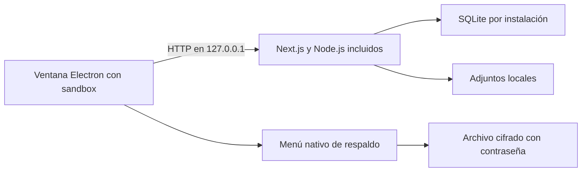

# EscuchaInterna para PC

La edición de escritorio convierte la consulta en un espacio de trabajo que pertenece al profesional. Se instala en Windows y opera sin necesitar un servidor remoto. La web SaaS conserva su arquitectura; el escritorio reutiliza sus contextos y activa diferencias explícitas con `ESCUCHAINTERNA_DESKTOP=1`.

## Alcance de la primera edición

- Instalador para Windows de 64 bits con acceso directo y ventana propia.
- Next.js y SQLite ejecutados en la PC; no se requiere instalar Node.js.
- Primera apertura sin pacientes demo, administradores predeterminados ni contraseñas compartidas. El profesional crea una cuenta local.
- Agenda, pacientes, expedientes, notas de sesión, pagos e importación existentes dentro del espacio local.
- Acceso local sin caducidad de prueba ni cobro de suscripción. La contraseña, el estado de cuenta, los permisos y el aislamiento por profesional siguen aplicándose.
- Datos persistentes fuera de la carpeta de instalación y claves generadas para esa instalación.
- Respaldo y restauración del espacio de trabajo desde el menú nativo, incluyendo los adjuntos y la información necesaria para recuperar los campos cifrados.
- Código fuente público bajo MIT y compilación documentada desde un repositorio sin datos de usuarios ni secretos.

## Decisiones de producto

**Privacidad por defecto.** No se necesita una cuenta en la nube para usar la consulta. El programa no instala claves de proveedores ni copia la base de datos usada por el desarrollador. El servidor se limita a la interfaz de loopback de la PC.

**Continuidad de los datos.** Instalar una nueva versión no debe reemplazar el espacio de trabajo. Un respaldo de la base de datos aislada no basta cuando hay adjuntos y claves de cifrado; la unidad de recuperación es el espacio completo.

**Disponibilidad honesta.** Correo, WhatsApp, pagos en línea, videollamadas e IA de proveedores necesitan sus adaptadores y conectividad. Los enlaces generados contra `127.0.0.1` no son accesibles desde el teléfono del paciente. El registro local/outbox no equivale a un mensaje entregado. Los procesos del programa trabajan mientras está abierto; no se promete ejecución con la PC apagada.

**Conocimiento con procedencia.** La distribución inicial no incluye el dataset CIE-11 ni las publicaciones originales. Su redistribución se gestiona separadamente de la licencia del software.

**Seguridad conservada.** La edición local elimina el gate comercial sin convertir las rutas privadas en públicas. Mantiene sesión, cifrado de campos, control de propietario, permisos y las comprobaciones clínicas existentes.

## Arquitectura

Los contextos de negocio siguen en `src/contexts`; `desktop` contiene el ciclo de vida de Windows, la ventana y la recuperación. Los scripts construyen desde una copia permitida del código para evitar que Next cargue `.env.local` o empaquete datos de desarrollo.

La primera implementación de respaldos acepta espacios de trabajo de hasta 256 MiB antes de comprimir. Si se supera ese límite, la operación se detiene con un mensaje. Al restaurar se conserva una copia del espacio anterior. La impresión y el guardado como PDF usan el diálogo nativo del programa; no se incluye un segundo navegador Chromium para generar PDFs en el servidor.

## Evolución pendiente

Desde 0.3.0, la apariencia incluye modo día/noche/automático, cuatro paletas y control de movimiento. La continuidad entre PCs se realiza publicando y recibiendo versiones completas cifradas mediante una carpeta de Google Drive para escritorio. Los archivos son inmutables y las divergencias se resuelven eligiendo una versión, conservando alternativas y la consulta local anterior. Ver [contrato y guía de sincronización](desktop-sync.md).

Estas mejoras requieren trabajo adicional y no se presentan como funciones terminadas: actualización automática con firmas verificadas, distribución con firma Authenticode, pruebas en otros Windows y arquitecturas, instalación en macOS/Linux, importación de catálogos con licencia verificada, fusión de cambios simultáneos entre equipos y portal remoto para pacientes.
